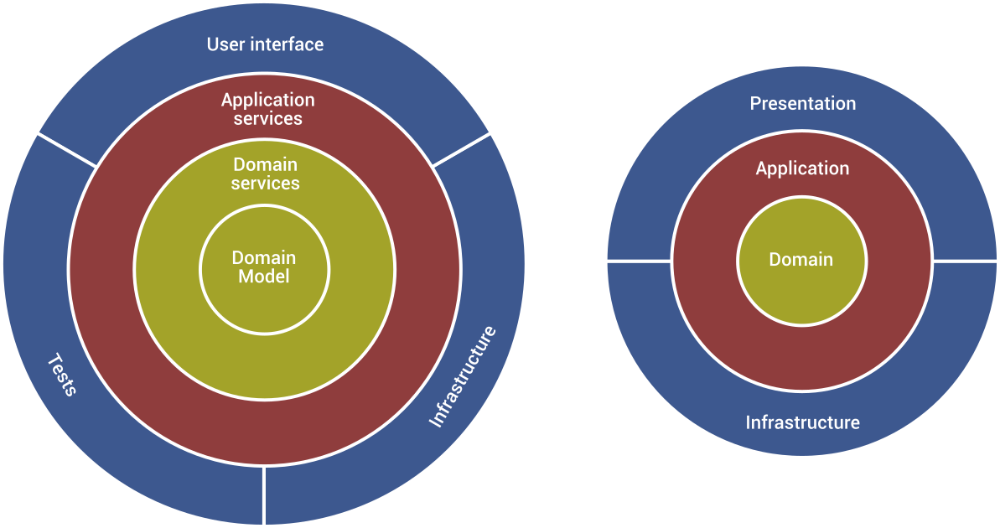
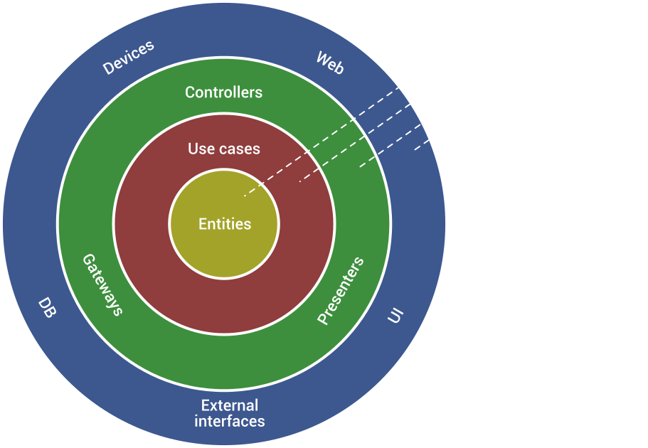

# 🏛️ Comparativa de Arquitecturas

## Tabla Comparativa Rápida

| Aspecto          | MVC              | N-Layer            | Hexagonal             | Onion              | Clean                | Vertical Slice    |
| ---------------- | ---------------- | ------------------ | --------------------- | ------------------ | -------------------- | ----------------- |
| **Autor**        | Trygve Reenskaug | Microsoft/Varios   | Alistair Cockburn     | Jeffrey Palermo    | Robert C. Martin     | Jimmy Bogard      |
| **Año**          | ~1979            | ~1990s             | ~2005                 | ~2008              | ~2012                | ~2015             |
| **Capas**        | 3 componentes    | 3+ capas           | Puertos/Adaptadores   | Capas tipo cebolla | 4 capas concéntricas | Por feature/slice |
| **Enfoque**      | UI separation    | Separación técnica | Puertos y adaptadores | Modelo de dominio  | Casos de uso         | Feature completa  |
| **Dependencias** | Model ← → View   | Top → Down         | Hacia el núcleo       | Hacia el centro    | Hacia el centro      | Minimizadas       |
| **Estado**       | 🔄 Pendiente     | 🔄 Pendiente       | 🔄 Pendiente          | 🔄 Pendiente       | ✅ Implementado      | 🔄 Pendiente      |

---

## 🏗️ MVC Architecture (Model-View-Controller)

**Año**: ~1979 (Xerox PARC)  
**Autor**: Trygve Reenskaug

### Concepto:

Patrón arquitectónico pionero que separó por primera vez la lógica de negocio de la presentación.

### Componentes:

- **Model**: Representa los datos y la lógica de negocio
- **View**: Presenta la información al usuario (UI)
- **Controller**: Maneja las interacciones del usuario y coordina Model/View

### Flujo Típico:

```
Usuario → Controller → Model → View → Usuario
```

### Ventajas:

✅ Separación clara entre UI y lógica  
✅ Múltiples vistas para el mismo modelo  
✅ Facilita testing del modelo  
✅ Patrón ampliamente conocido

### Desafíos:

⚠️ Controller puede volverse muy grande (Fat Controller)  
⚠️ Dependencias bidireccionales Model ↔ View  
⚠️ No escala bien en aplicaciones complejas  
⚠️ Poca guidance para organizar lógica de negocio

### A Implementar:

🔄 Controllers para cada caso de uso  
🔄 Models de dominio  
🔄 Views/Presenters JSON  
🔄 Routing y middleware

---

## 📚 N-Layer Architecture (Arquitectura en Capas Tradicional)

**Año**: ~1990s  
**Popularizada por**: Microsoft, Martin Fowler

### Concepto:

Arquitectura tradicional que organiza el código en capas horizontales por responsabilidad técnica.

### Capas Típicas:

```
┌─────────────────────────────────┐
│   Presentation Layer (UI/API)   │
├─────────────────────────────────┤
│   Business Logic Layer (BLL)    │
├─────────────────────────────────┤
│   Data Access Layer (DAL)       │
├─────────────────────────────────┤
│   Database                      │
└─────────────────────────────────┘
```

### Flujo de Dependencias:

Presentation → Business Logic → Data Access → Database

⚠️ **Problema**: Las dependencias pueden fluir en ambas direcciones (no hay inversión de dependencias)

### Ventajas:

✅ Muy simple de entender  
✅ Ideal para CRUDs  
✅ Familiaridad en la industria  
✅ Rápido de implementar

### Desafíos:

⚠️ Dependencias hacia la base de datos  
⚠️ Difícil de testear (acoplamiento a DB)  
⚠️ Business Logic acoplada a infraestructura  
⚠️ No protege las reglas de negocio  
⚠️ Database-centric (no domain-centric)

### A Implementar:

🔄 Presentation Layer con controllers  
🔄 Business Logic Layer con services  
🔄 Data Access Layer con repositories  
🔄 DTOs entre capas

---

## ⬡ Hexagonal Architecture (Ports & Adapters)

**Año**: ~2005  
**Autor**: Alistair Cockburn

### Concepto:

Arquitectura que estructura la aplicación en un núcleo (hexágono) rodeado de adaptadores. No usa capas tradicionales, sino una simetría entre adaptadores que conducen la aplicación (driving) y los que son conducidos (driven).

### Estructura Visual:

```
        ┌─────────────────┐
        │  REST Adapter   │ ◄── Driving
        └────────┬────────┘     (Primary)
                 │
    ┌────────────▼────────────┐
    │                         │
    │   ┌──────────────┐      │
    │   │              │      │
    │   │  Application │      │
    │   │     Core     │      │
    │   │   (Domain)   │      │
    │   │              │      │
    │   └──────────────┘      │
    │         Hexágono        │
    └────────────┬────────────┘
                 │
        ┌────────▼────────┐
        │  DB Adapter     │ ◄── Driven
        └─────────────────┘     (Secondary)
```

### Componentes Clave:

- **Puertos**: Interfaces (contratos) que define el núcleo
- **Adaptadores**: Implementaciones concretas de los puertos
- **Application Core**: Lógica de negocio y dominio
- **Driving Adapters**: Controladores, UI, API (lado izquierdo)
- **Driven Adapters**: Repositorios, servicios externos (lado derecho)

### Ventajas:

✅ Simetría conceptual clara  
✅ Muy flexible para múltiples adaptadores  
✅ Fácil agregar/cambiar adaptadores  
✅ Altamente testable  
✅ Independencia total de frameworks

### Desafíos:

⚠️ Concepto menos conocido que capas  
⚠️ Puede confundir sin estructura de capas clara  
⚠️ Requiere disciplina para mantener simetría  
⚠️ Documentación menos abundante

### A Implementar:

🔄 Application Core con dominio  
🔄 Driving Ports & Adapters (UI/API)  
🔄 Driven Ports & Adapters (DB/External)  
🔄 Configuración de inyección de dependencias

---

## 🧅 Onion Architecture

**Año**: ~2008  
**Autor**: Jeffrey Palermo

### Concepto:

Arquitectura que organiza el código en capas concéntricas tipo cebolla, con el Domain Model en el centro. Todas las dependencias apuntan hacia el centro, protegiendo el modelo de dominio de cambios externos.

### Diagrama Visual:



_Diagrama de las capas tipo cebolla de Onion Architecture con el Domain Model en el centro._

### Capas (de adentro hacia afuera):

1. **Domain Model**: Entidades y reglas de negocio fundamentales
2. **Domain Services**: Operaciones de dominio que no pertenecen a una entidad
3. **Application Services**: Casos de uso y orquestación
4. **Infrastructure**: Persistencia, APIs externas, frameworks

**Flujo de Dependencias:** Todas las capas externas → Domain Model (centro)

### Ventajas:

✅ Modelo de dominio rico y protegido  
✅ Mejor encapsulación del dominio  
✅ Flexibilidad en número de capas  
✅ Excelente para Domain-Driven Design  
✅ Independencia de infraestructura

### Desafíos:

⚠️ Domain Services pueden confundirse con Application Services  
⚠️ Curva de aprendizaje moderada  
⚠️ Puede ser over-engineering para dominios simples  
⚠️ Requiere entender DDD para máximo beneficio

### A Implementar:

🔄 Domain Model rico con comportamiento  
🔄 Domain Services  
🔄 Application Services  
🔄 Infrastructure layer  
🔄 Dependency injection configuration

---

## 🎯 Clean Architecture

**Año**: ~2012  
**Autor**: Robert C. Martin (Uncle Bob)

### Concepto:

Arquitectura de 4 capas concéntricas que maximiza la independencia de frameworks, UI y base de datos. Enfatiza casos de uso como organizadores principales y separa claramente las reglas de negocio de los detalles de implementación.

### Diagrama Visual:



_Diagrama de las capas concéntricas de Clean Architecture mostrando el flujo de dependencias hacia el centro._

### Capas (de adentro hacia afuera):

1. **Entities (Enterprise Business Rules)**: Entidades y reglas de negocio de alto nivel
2. **Use Cases (Application Business Rules)**: Casos de uso específicos de la aplicación
3. **Interface Adapters**: Controllers, Presenters, Gateways
4. **Frameworks & Drivers**: Web, DB, External APIs, UI

**Regla de Dependencia:** Las dependencias solo pueden apuntar hacia adentro

### Ventajas:

✅ Separación muy clara de responsabilidades  
✅ Altamente testable (cada capa independiente)  
✅ Independiente de frameworks y UI  
✅ Reglas de negocio completamente protegidas  
✅ Facilita cambios de tecnología

### Desafíos:

⚠️ Curva de aprendizaje alta  
⚠️ Muchos archivos y carpetas  
⚠️ Puede ser over-engineering para apps simples  
⚠️ Más boilerplate y ceremony  
⚠️ Requiere disciplina del equipo

### A Implementar:

✅ Entities (completado)  
✅ Use Cases (completado)  
✅ Controllers & Presenters (completado)  
✅ Frameworks & Drivers (completado)  
✅ Documentación completa

---

## 📐 Vertical Slice Architecture

**Año**: ~2015  
**Autor**: Jimmy Bogard

### Concepto:

Arquitectura que organiza el código por features completas (slices verticales) en lugar de capas técnicas horizontales. Cada slice contiene todo lo necesario para implementar una funcionalidad end-to-end, minimizando acoplamiento entre features.

### Estructura Visual:

```
features/
├── create-cart/
│   ├── CreateCart.cs           # Handler completo
│   ├── CreateCartValidator.cs  # Validación
│   └── CreateCartEndpoint.cs   # Endpoint
├── add-product-to-cart/
│   ├── AddProductToCart.cs
│   ├── AddProductValidator.cs
│   └── AddProductEndpoint.cs
├── get-cart/
│   ├── GetCart.cs
│   └── GetCartEndpoint.cs
└── shared/
    ├── Cart.cs                 # Entidad compartida (mínima)
    └── ICartRepository.cs      # Abstracción compartida (mínima)
```

### Principios Clave:

- **Vertical Slice**: Feature completa desde API hasta DB en un solo lugar
- **Minimal Coupling**: Cada slice es independiente, mínimo código compartido
- **No Layers**: Sin separación técnica horizontal (no capas)
- **Shared Kernel**: Solo lo absolutamente esencial se comparte

### Filosofía:

> "Organiza por lo que cambia junto, no por tipo técnico"

- Las capas asumen que toda la capa cambia junta
- Vertical Slice asume que cada feature cambia independientemente
- Minimiza abstracciones prematuras
- Maximiza cohesión por caso de uso

### Ventajas:

✅ Extremadamente simple de entender  
✅ Cambios localizados (todo en un lugar)  
✅ Menos abstracciones innecesarias  
✅ Fácil agregar/remover features  
✅ Ideal para equipos pequeños  
✅ Alta velocidad de desarrollo

### Desafíos:

⚠️ Puede haber duplicación de código  
⚠️ Menos reutilización entre features  
⚠️ Requiere disciplina para mantener slices independientes  
⚠️ Puede crecer desordenado en proyectos grandes  
⚠️ Shared kernel puede crecer si no hay disciplina

### A Implementar:

🔄 Features organizadas por slice  
🔄 Handlers independientes con MediatR  
🔄 Minimal shared kernel (solo entidades básicas)  
🔄 Endpoints independientes por feature  
🔄 Validación por slice

---

## 🎭 Similitudes y Diferencias

### Tabla de Características

| Principio                   | MVC        | N-Layer     | Hexagonal | Onion   | Clean   | Vertical Slice |
| --------------------------- | ---------- | ----------- | --------- | ------- | ------- | -------------- |
| Inversión de Dependencias   | ❌         | ❌          | ✅        | ✅      | ✅      | ⚠️ Mínima      |
| Dominio en el Centro        | ❌         | ❌          | ✅        | ✅      | ✅      | ⚠️ Distribuido |
| Independencia de Frameworks | ⚠️ Parcial | ❌          | ✅        | ✅      | ✅      | ✅             |
| Testabilidad                | ⚠️ Parcial | ⚠️ Difícil  | ✅        | ✅      | ✅      | ✅             |
| Boundaries Explícitos       | ⚠️ Débil   | ⚠️ Débil    | ✅        | ✅      | ✅      | ⚠️ Por Feature |
| Acoplamiento a DB           | ⚠️ Alto    | ❌ Muy Alto | ✅ Bajo   | ✅ Bajo | ✅ Bajo | ⚠️ Variable    |

---

## 🔄 Diferencias Clave

### Arquitecturas Tradicionales vs Modernas:

**MVC & N-Layer (Pre-2005)**:

- Enfoque en separación técnica
- Sin inversión de dependencias
- Database-centric
- Acoplamiento a infraestructura

**Hexagonal, Onion & Clean (2005-2012)**:

- Domain-centric
- Inversión de dependencias
- Puertos/Interfaces
- Independencia de infraestructura

**Vertical Slice (2015+)**:

- Feature-centric
- Pragmatismo sobre pureza
- Mínimas abstracciones
- Velocidad de desarrollo

### Clean vs Onion:

- **Clean**: 4 capas fijas, enfoque en use cases
- **Onion**: Capas flexibles, enfoque en domain model

### Clean vs Hexagonal:

- **Clean**: Capas concéntricas verticales
- **Hexagonal**: Simetría horizontal (puertos/adaptadores)

### Onion vs Hexagonal:

- **Onion**: Capas anidadas
- **Hexagonal**: Sin capas, solo núcleo + adaptadores

### Capas vs Slices:

- **Clean/Onion/Hexagonal**: Organización horizontal por tipo técnico
- **Vertical Slice**: Organización vertical por feature/caso de uso
- **Trade-off**: Reutilización vs. Simplicidad

---

## 📊 Cuándo Usar Cada Una

### MVC Architecture

**Ideal para:**

- Aplicaciones web tradicionales con server-side rendering
- Proyectos pequeños con UI simple
- Cuando el equipo ya conoce MVC
- Prototipado rápido

**Evitar en:**

- Aplicaciones enterprise complejas
- Cuando se requiere alta testabilidad
- Proyectos con lógica de negocio compleja
- Arquitecturas desacopladas

### N-Layer Architecture

**Ideal para:**

- CRUDs simples
- Aplicaciones con poca lógica de negocio
- Proyectos legacy en mantenimiento
- Equipos sin experiencia en arquitecturas avanzadas

**Evitar en:**

- Cuando testabilidad es crítica
- Proyectos que requieren independencia de DB
- Aplicaciones con reglas de negocio complejas
- Cuando se necesita cambiar frecuentemente de infraestructura

### Hexagonal Architecture

**Ideal para:**

- Proyectos con muchas integraciones
- Microservicios
- Cuando simplicidad es prioridad
- Testing intensivo

**Evitar en:**

- Cuando se necesita más estructura
- Equipos que prefieren capas claras
- Primera vez implementando arquitectura limpia

### Onion Architecture

**Ideal para:**

- Aplicaciones con dominio rico
- Cuando DDD es importante
- Necesidad de evolución del modelo de dominio
- Proyectos con lógica de negocio compleja

**Evitar en:**

- CRUDs simples
- Dominios anémicos
- Proyectos con poco comportamiento de negocio

### Clean Architecture

**Ideal para:**

- Proyectos enterprise grandes
- Equipos que valoran estructura clara
- Sistemas con múltiples use cases complejos
- Cuando se requiere máxima testabilidad

**Evitar en:**

- Proyectos pequeños/MVPs
- Cuando el tiempo de desarrollo es crítico
- Equipos sin experiencia en arquitecturas limpias

### Onion Architecture

**Ideal para:**

- Aplicaciones con dominio rico
- Cuando DDD es importante
- Necesidad de evolución del modelo de dominio
- Proyectos con lógica de negocio compleja

**Evitar en:**

- CRUDs simples
- Dominios anémicos
- Proyectos con poco comportamiento de negocio

### Hexagonal Architecture

**Ideal para:**

- Proyectos con muchas integraciones
- Microservicios
- Cuando simplicidad es prioridad
- Testing intensivo

**Evitar en:**

- Cuando se necesita más estructura
- Equipos que prefieren capas claras
- Primera vez implementando arquitectura limpia

### Vertical Slice Architecture

**Ideal para:**

- Proyectos nuevos/MVPs que necesitan velocidad
- Equipos pequeños que valoran simplicidad
- Aplicaciones CRUD-heavy con features independientes
- Cuando el código cambia frecuentemente por feature
- Reducir ceremony y boilerplate

**Evitar en:**

- Dominios complejos con mucha lógica compartida
- Cuando se requiere máxima reutilización
- Equipos grandes que necesitan estructura clara
- Proyectos con alta complejidad algorítmica

---

## 🎯 Roadmap del Proyecto

### ✅ Fase 1: Clean Architecture (COMPLETADA)

- [x] Implementación de 4 capas
- [x] 11 use cases funcionales
- [x] Repositorios in-memory
- [x] Web API con Express
- [x] Documentación completa
- [x] Análisis y reporte completo

### 🔄 Fase 2: MVC Architecture (PENDIENTE)

- [ ] Setup del proyecto
- [ ] Controllers para cada ruta
- [ ] Models de dominio
- [ ] Views/JSON responses
- [ ] Comparativa con Clean

### 🔄 Fase 3: N-Layer Architecture (PENDIENTE)

- [ ] Setup del proyecto
- [ ] Presentation Layer
- [ ] Business Logic Layer
- [ ] Data Access Layer
- [ ] Comparativa con arquitecturas modernas

### 🔄 Fase 4: Hexagonal Architecture (PENDIENTE)

- [ ] Setup del proyecto
- [ ] Application Core
- [ ] Driving Ports & Adapters
- [ ] Driven Ports & Adapters
- [ ] Comparativa con Clean y Onion

### 🔄 Fase 5: Onion Architecture (PENDIENTE)

- [ ] Setup del proyecto
- [ ] Domain Model rico
- [ ] Domain Services
- [ ] Application Services
- [ ] Infrastructure layer
- [ ] Comparativa con Clean

### 🔄 Fase 6: Vertical Slice Architecture (PENDIENTE)

- [ ] Setup del proyecto
- [ ] Features por slice
- [ ] Handlers independientes
- [ ] Minimal abstracciones
- [ ] Comparativa con arquitecturas en capas

### 🔄 Fase 7: Documentación Final

- [ ] Comparativa detallada de las 6
- [ ] Evolución histórica de arquitecturas
- [ ] Guía de decisión: cuándo usar cada una
- [ ] Casos de estudio
- [ ] Conclusiones y recomendaciones
- [ ] Trade-offs: Tradicionales vs Modernas vs Pragmáticas

---

## 📚 Referencias

### MVC Architecture

- � [MVC Original Paper - Trygve Reenskaug](http://heim.ifi.uio.no/~trygver/themes/mvc/mvc-index.html)
- 📝 [GUI Architectures - Martin Fowler](https://martinfowler.com/eaaDev/uiArchs.html)
- 📘 [Patterns of Enterprise Application Architecture - Fowler](https://martinfowler.com/books/eaa.html)

### N-Layer Architecture

- 📝 [N-Layer Architecture - Microsoft Docs](https://learn.microsoft.com/en-us/dotnet/architecture/modern-web-apps-azure/common-web-application-architectures)
- 📝 [Layered Architecture - Martin Fowler](https://martinfowler.com/bliki/PresentationDomainDataLayering.html)
- � [Application Architecture Guide - Microsoft](<https://docs.microsoft.com/en-us/previous-versions/msp-n-p/ff650706(v=pandp.10)>)

### Hexagonal Architecture

- 📝 [Hexagonal Architecture Original](https://alistair.cockburn.us/hexagonal-architecture/)
- 📝 [Ports and Adapters Pattern](https://herbertograca.com/2017/09/14/ports-adapters-architecture/)
- 📘 [Hexagonal Architecture Explained](https://netflixtechblog.com/ready-for-changes-with-hexagonal-architecture-b315ec967749)

### Onion Architecture

- 📝 [Onion Architecture Original](https://jeffreypalermo.com/2008/07/the-onion-architecture-part-1/)
- 📝 [Understanding Onion Architecture](https://www.codeguru.com/csharp/understanding-onion-architecture/)

### Clean Architecture

- 📘 [Clean Architecture Book](https://www.amazon.com/Clean-Architecture-Craftsmans-Software-Structure/dp/0134494164)
- 🎥 [Uncle Bob - Clean Architecture](https://www.youtube.com/watch?v=Nsjsiz2A9mg)
- 📝 [Clean Architecture Blog](https://blog.cleancoder.com/uncle-bob/2012/08/13/the-clean-architecture.html)

### Vertical Slice Architecture

- 📝 [Vertical Slice Architecture - Jimmy Bogard](https://www.jimmybogard.com/vertical-slice-architecture/)
- 🎥 [GOTO 2018 - Vertical Slice Architecture](https://www.youtube.com/watch?v=SUiWfhAhgQw)
- 📝 [Restructuring to a Vertical Slice Architecture](https://codeopinion.com/restructuring-to-a-vertical-slice-architecture/)

---

**Última Actualización**: 8 de marzo de 2026
